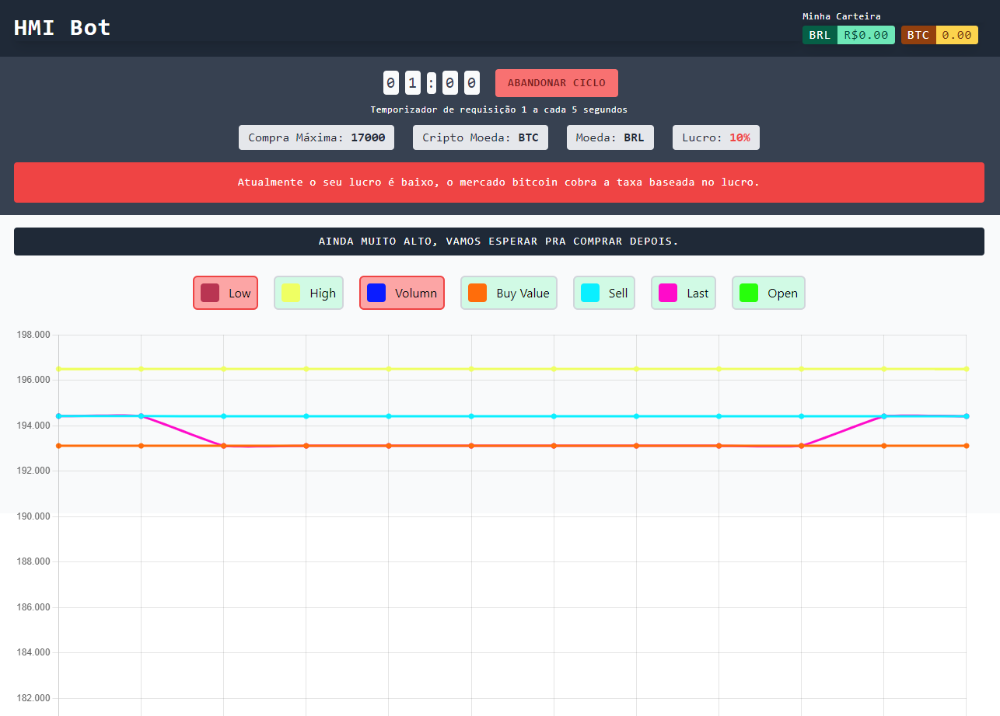
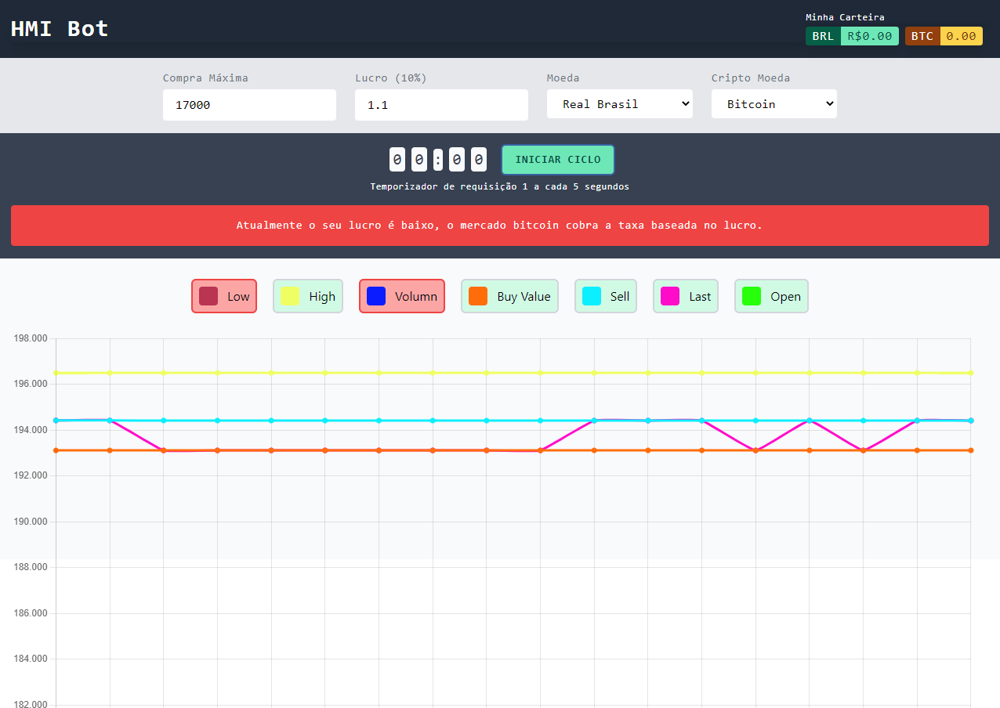

# HMI Bitcoin Bot
This is a simple bitcoin bot for MercadoBitcoin. Based in NodeJS tutorial from [LuizTools - Bot de compra e venda](https://www.luiztools.com.br/post/como-criar-um-bot-de-compra-e-venda-de-bitcoin-usando-node-js/).

HMI are the initials letter of my cats name:
_Hermanoteu - Micalateia - Isi_

> ### Bot Active

> ### Bot Inactive

> ## Used Tecnology and Libs
This app does't use great patterns, just created for study.
 - Typescript
 - React
 - NextJS
 - Tailwind (This Layout does't responsible)
 - React-Chart v2

> ## Advise

Use it with you own risk, i'm not responsablized for lose or profit of values.
Keep your key secure.

> ## Info

Ticker object information

- **high**  - High price value
- **low** -  Low price value
- **vol** - Quantity coins negotiated
- **last**  - Value of last negociation
- **buy** - High offer for buy
- **sell**  - Low offer for sell
- **open**  - Opened offers

> ### DotEnv Data
- **KEY** -  mercado bitcoin Public Key
- **SECRET** - Mercado bitcoin Secret Key
- **PIN** - Mercado Bitcoin Pin

## Trade
You can see your money values in header of the page on right side.

In main api route for mercadobitcoin, you pass maxBy parameter, its used in checkPrice, this function check the current ticker value and compare with you max value to make a transaction.

**Remember** Use it with you own risk, i'm not responsablized for lose or profit of values.
Keep your key secure.

For more informations, acess the NodeJS tutorial [LuizTools - Bot de compra e venda](https://www.luiztools.com.br/post/como-criar-um-bot-de-compra-e-venda-de-bitcoin-usando-node-js/)
